# ML on the MCU
This project was possible due to the datasets available on [www.kaggle.com](https://www.kaggle.com). Huge thank you to the creators of both datasets. Find out more about the datasets and their authors:
  * [MCU Cast Headshots](https://www.kaggle.com/rawatjitesh/avengers-face-recognition/discussion)
  * [MCU Scripts](https://www.kaggle.com/pdunton/marvel-cinematic-universe-dialogue?select=mcu.csv)

##### __TO RUN THIS PROJECT, YOU MUST ADD THE DATA INTO THE DATA FOLDER__
##### __DATA > IMAGES > ALL [FOR THE IMAGES]__
##### __DATA > MCU.CSV [FOR THE SCRIPTS]__
---

See my slideshow presentation -> https://docs.google.com/presentation/d/1jZAaJ9fcv64-ndfwdH1Vw5dqB6IYyTe3vrMo1pGYMp0/edit?usp=sharing

---

## Natural Language Processing
* Limitations and Challenges
  * Data Imbalance
  * Scripts written by multiple writers
  * Non Character Significant dialogue

* Metrics
  * Accuracy
  * Recall
  * Precision

* Multinomial Naive Bayes
  * Lemmatization
  * English and Custom Stop Words

#### Exploratory Data Analysis

I explored a variety of characters and their lines within the film but there was a very noticeable imbalance within the amount of lines each character had. __Tony Stark came in first with a total of ~1700 lines.__ Below is a bar chart of the 5 characters I chose for my initial analysis but within my [plots](github.com) folder you'll find other examples I did as well.

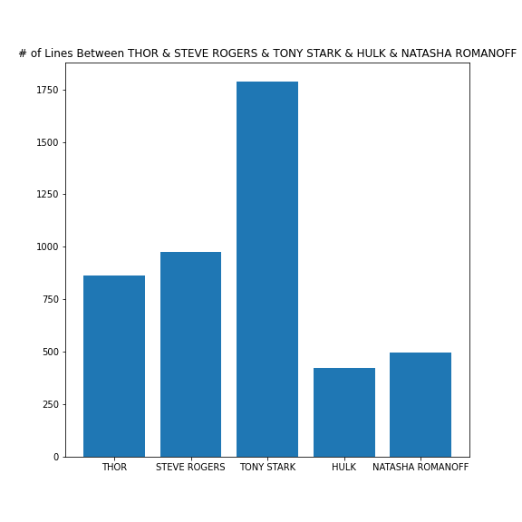

#### Word Importance Within Characters

The complications of using this script for machine learning include scripts written by multiple writers and non significant character dialogue (plenty). Many of the lines the model cannot correctly classify are words that have no significance towards the character such as *Go get him* or *thanks*. Phrases that hold no owner because they can in theory be said by any human. With the usage of __custom stop words__ vs using __english stop words__ we can try and counter this issue a bit. Below you'll see the unique words for characters within the film. *But __BEWARE__: some characters just don't have enough significant lines and quantity of lines that their __significant words__ are also just regular common words*

###### Using English Stop Words
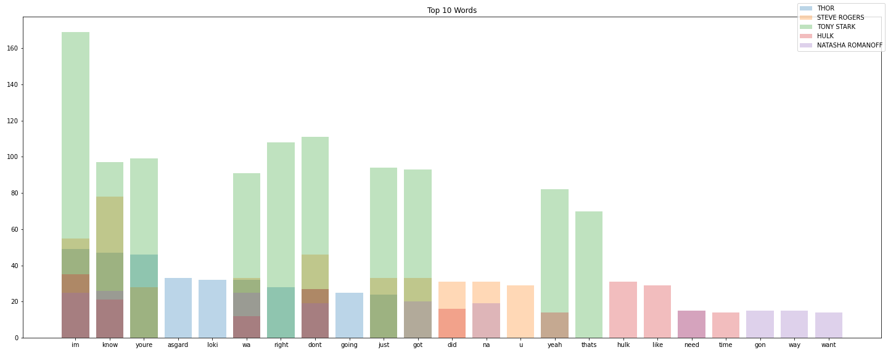

###### Using Custom Stop Words
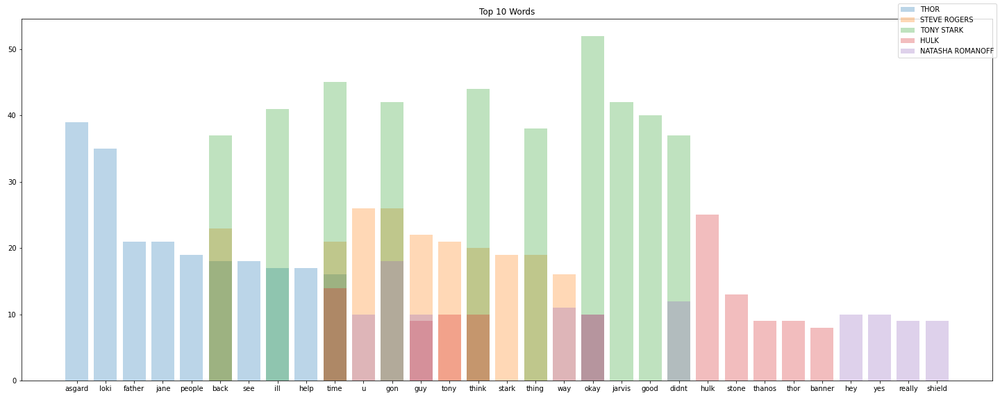

#### Accuracy vs Recall vs Precision
__Accuracy does not always means a model is good.__ The model using english stop words had a 0.44% accuracy on predicting never before seen phrases but had 0 recall on two different characters, meaning it guessed these characters as a classifier 0 times, completely disregarding that they even exist. *See Confusion Matrix Below*

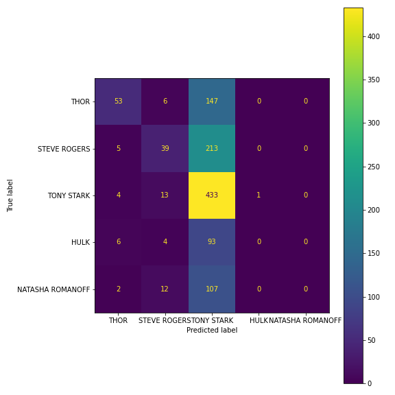

When removing Hulk, Natasha, and Tony Stark from our characters used, you'll see a positive change in accuracy and recall. The confusion matrix shows what we'd like to see in a confusion matrix, a brighter diagonal (where bright colors represent correct guesses) *See Confusion Matrix Below*

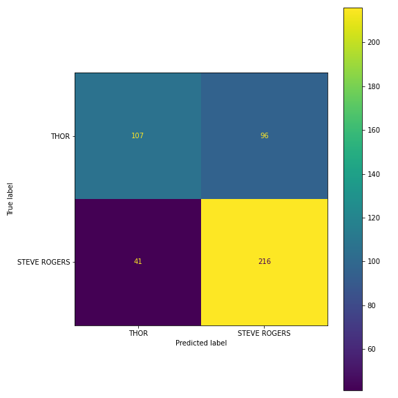

When entered into our model, it showed 70.21% accuracy. The important word distribution was a lot different, including actual unique words __such as "loki"__ for Thor.

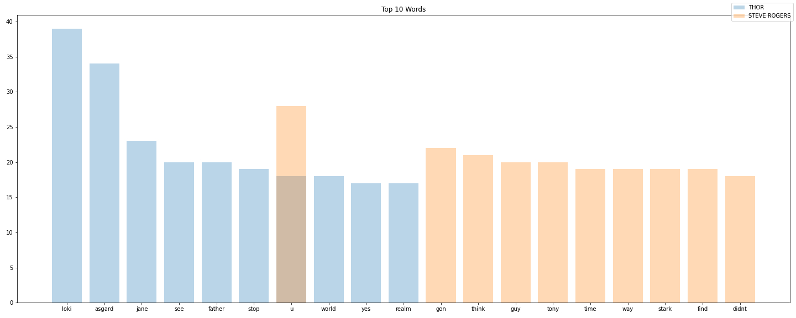

###### Checkout some of the phrases my model got wrong. Would you have been able to guess them?

---------------------------------

thank you

Model Predicted: TONY STARK

Actually Said By: STEVE ROGERS

---------------------------------

so the question is who in shield could launch a domestic missile strike

Model Predicted: TONY STARK

Actually Said By: NATASHA ROMANOFF

---------------------------------

pregnant

Model Predicted: TONY STARK

Actually Said By: STEVE ROGERS

---------------------------------

## Image Classification
* Exploratory Data Analysis
  * Image Distribution
    * Chris Evans - __50__
    * Chris Hemsworth - __53__
    * Mark Ruffalo - __63__
    * Robert Downey jr - __51__
    * Scarlett Johansson - __54__

* Metrics
  * Accuracy

* Neural Networks
  * CNNs

* Logistic Regression

#### Exploratory Data Analysis
The kaggle dataset features the same five characters I used for NLP, Chris Evans, Chris Hemsworth, Robert Downey JR, Scarlett Johansson, and Mark Ruffalo.

Here's how the original images look like

In order to be able to do good image classification and not over complicate things with multiple dimensions we grayscale the images. To add some more data to our model we also flip every image left to right, so our model learns a different way of seeing these images and features.

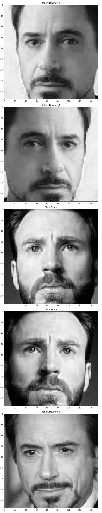

#### Image Classification Models

<table class="tg">
<thead>
  <tr>
    <th class="tg-0pky">Neural Network</th>
    <th class="tg-0pky">Simple CNN</th>
    <th class="tg-0pky">Custom Deeper CNN</th>
    <th class="tg-0pky">Logistic Regression</th>
  </tr>
</thead>
<tbody>
  <tr>
    <td class="tg-0pky">Total params: 15,813,125</td>
    <td class="tg-0pky">Total params: 127,269</td>
    <td class="tg-0pky">Total params: 6,685,573</td>
    <td class="tg-0pky">Solver: 'Saga' Tol: 0.1</td>
  </tr>
  <tr>
    <td class="tg-0pky">3 Layers<ul> <li>Flatten</li><li>Dense</li><li>Dense</li><li>Output (Softmax)</li></ul></td>
    <td class="tg-0pky">7 Layers<ul><li>Avg Pooling</li><li>2 Conv</li><li>Max Pooling</li><li>Dropout</li><li>Flatten</li><li>Output (Softmax)</li></td>
    <td class="tg-0pky">13 Layers<ul><li>Max Pooling</li><li>2 Conv</li><li>Max Pooling</li><li>2 Conv</li><li>Dropout</li><li>Max Pooling</li><li>Conv</li><li>Flatten</li><li>Dense</li><li>Dropout</li><li>Output (Softmax)</li></ul></td>
    <td class="tg-0pky"><ul><li>Pixel Importance</li><li>Better than first 2 models</li><li>More data</li></ul></td>
  </tr>
  <tr>
    <td class="tg-0pky">40.1% Accuracy</td>
    <td class="tg-0pky">54.7% Accuracy</td>
    <td class="tg-0pky">92% Accuracy</td>
    <td class="tg-0pky">67.88% Accuracy</td>
  </tr>
</tbody>
</table>

#### Models Loss

##### Default Neural Network

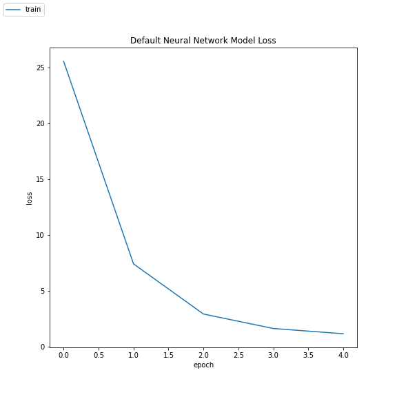

##### Simple Convolutional Neural Network

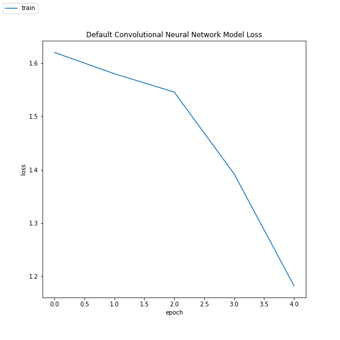

##### Simple Convolutional Neural Network

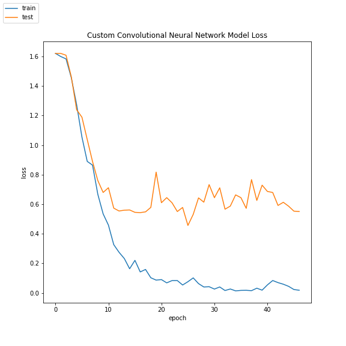

#### Models Confusion Matrix

##### Default Neural Network

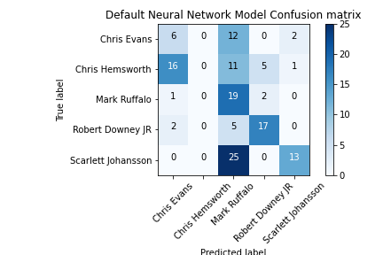

##### Simple Convolutional Neural Network

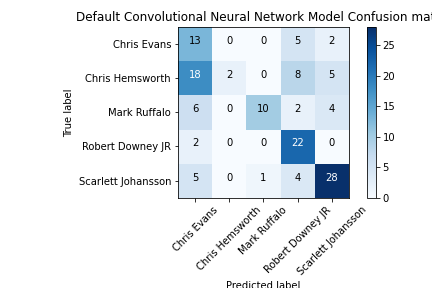

##### Custom Convolutional Neural Network

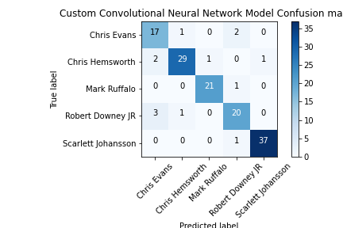

---
#### The Beauty of Logistic Regression Classifiers

Logistic Regression allows for better interpretability. One of the best parts of easier interpretability is being able to see what our model uses to predict one or the other. Through pixel importance we can see what pixels positively impact our model when considering a class.

*Check out the pixel importance for our different classes. __Blue are the pixels that positively impact our prediction probability__ and __red are the pixels that negatively impact our prediction probability__.*

##### Do they look like the people they represent? & Does it give you an idea of why our model can struggle a bit in correctly identifying each class?

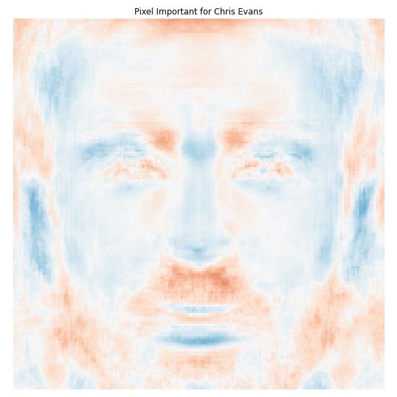

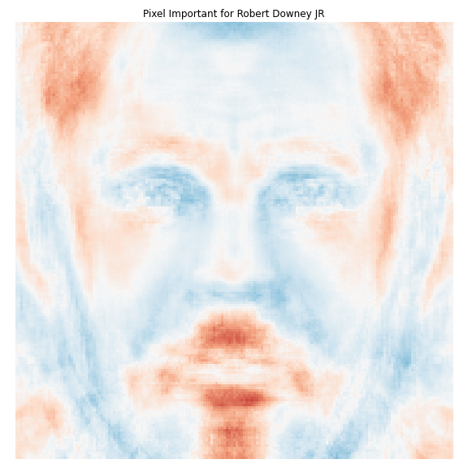

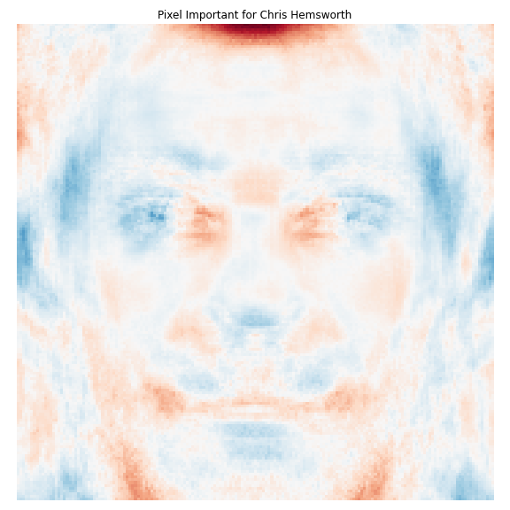

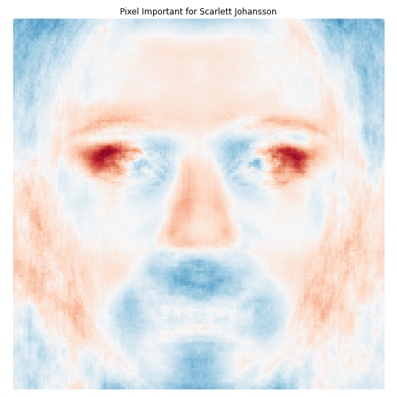

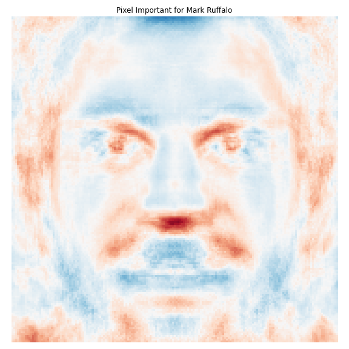

---

Hope you enjoyed my project! Feel free to check out my github for other projects I've done.
